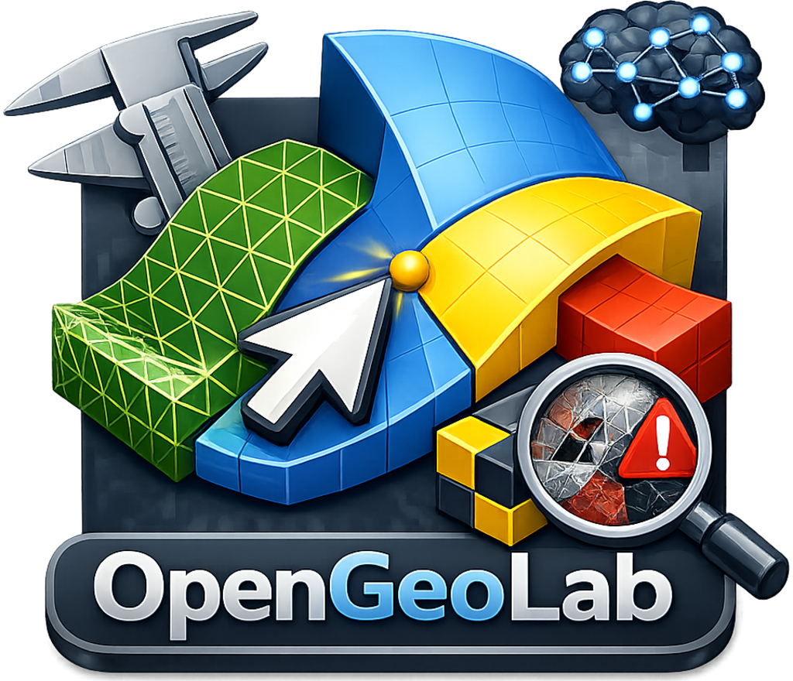
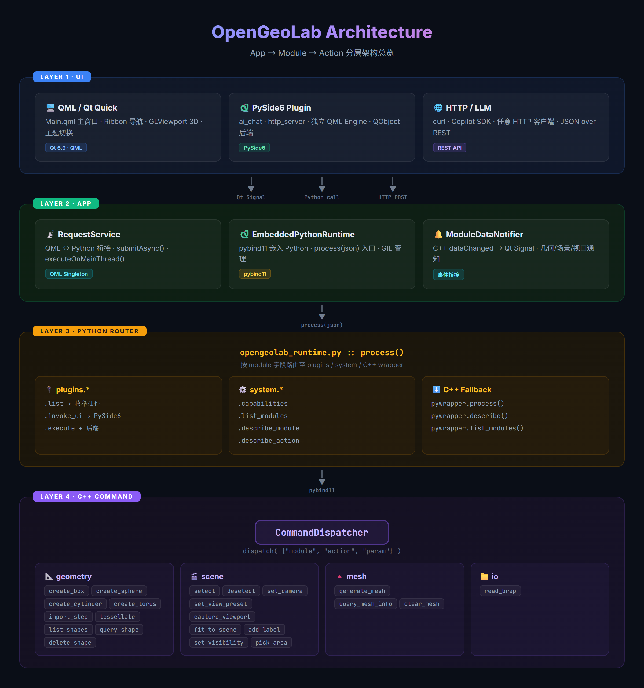
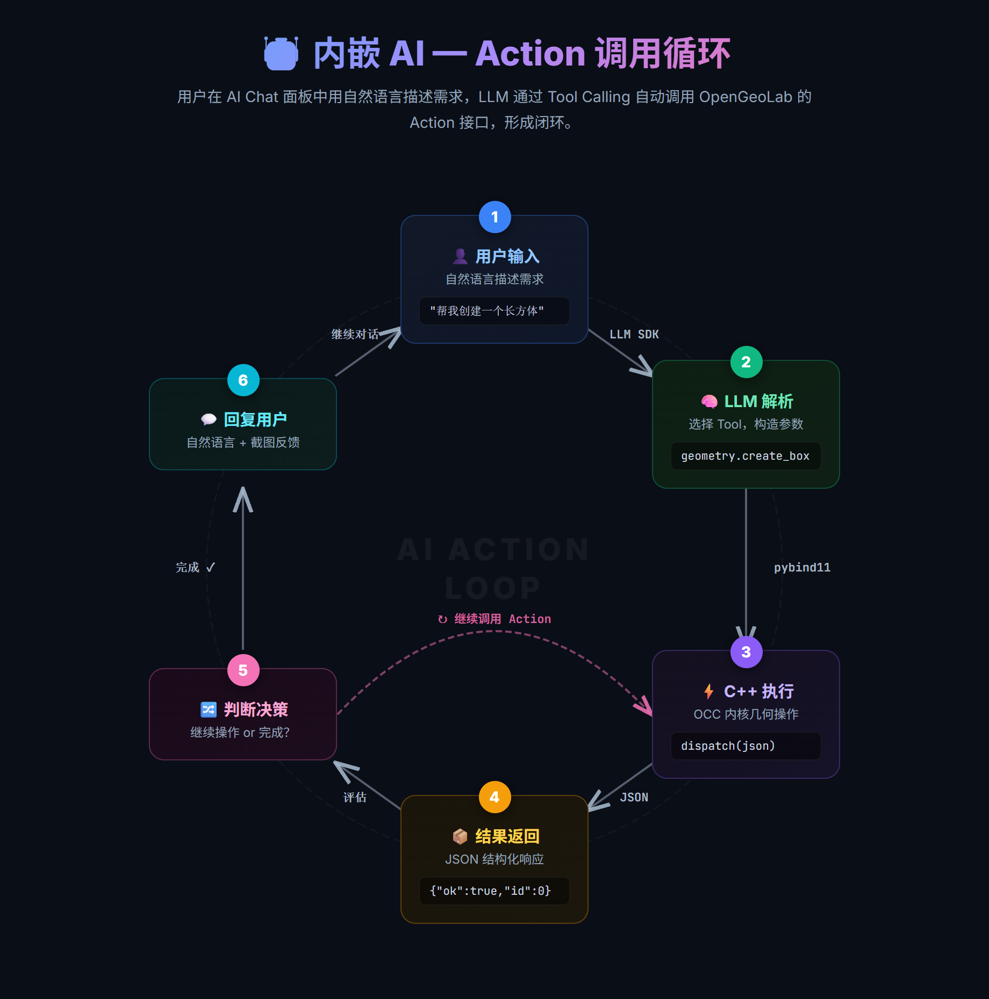
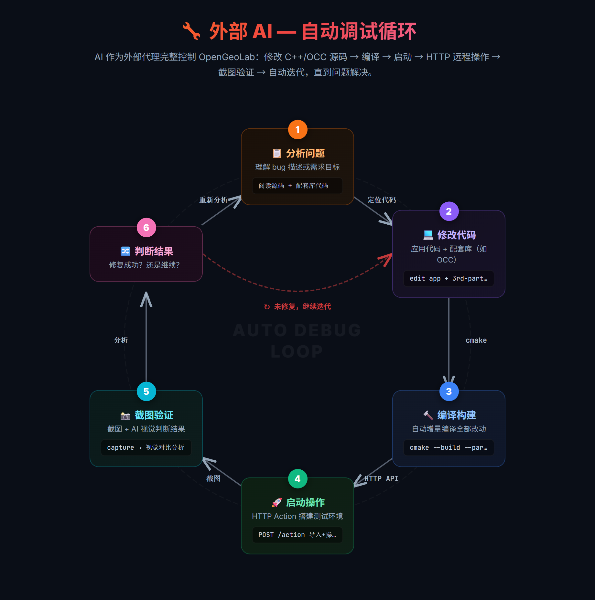

<div align="center">



# OpenGeoLab

**AI 驱动的开源 3D 几何建模平台**

[](https://www.gnu.org/licenses/gpl-3.0)
[](https://isocpp.org/)
[](https://www.qt.io/)
[](https://dev.opencascade.org/)

[English](README_en.md) · [构建指南](#-快速开始) · [架构总览](#-架构总览) · [插件开发](#-插件系统)

</div>

---

## ✨ 特性亮点

<table>
<tr>
<td width="50%">

### 🤖 AI 原生交互

内置 AI 对话插件，通过自然语言驱动几何建模、网格生成、
场景管理等全部操作。基于 JSON Action 协议，AI 可直接调用
底层 C++ 模块能力。

</td>
<td width="50%">

### 🧩 模块化 Action 架构

所有功能以 `module.action` 形式注册，统一 JSON 请求/响应协议。
每个 Action 自描述参数与返回值，天然适配 LLM Function Calling。

</td>
</tr>
<tr>
<td>

### 🐍 Python 插件系统

嵌入式 Python 运行时 + pybind11 桥接，插件可访问全部 C++ 模块。
支持 PySide6 UI 扩展，热加载插件，快速原型验证。

</td>
<td>

### 🔬 工业级 CAD 内核

基于 OpenCASCADE 的精确几何建模 + Gmsh 有限元网格生成。
支持 BREP/STEP 导入、布尔运算、参数化建模。

</td>
</tr>
<tr>
<td>

### 🎨 实时 OpenGL 渲染

纯 OpenGL 3.3 Core 多 Pass 渲染管线：不透明体、线框、高亮、
选择、标签。支持 DPI 感知、厚线渲染、MSDF 文字标签。

</td>
<td>

### 🎯 统一实体选择系统

EntityRef 抽象统一寻址几何拓扑（面/边/顶点）、网格单元和
场景节点。支持单击拾取、框选、类型过滤、悬停高亮。

</td>
</tr>
</table>

---

## 🏗️ 架构总览

<div align="center">

</div>

---

## 🤖 AI 集成

OpenGeoLab 的核心设计哲学之一是 **AI-First**：所有模块操作通过统一的
JSON Action 协议暴露，使 AI 可以像人类用户一样操控整个平台。

### 内嵌 AI — Action 调用循环

用户在 AI Chat 面板中用自然语言描述需求，LLM 通过 Tool Calling 自动调用
Action 接口，形成"对话 → 调用 → 反馈 → 再调用"的闭环。

<div align="center">

</div>

### 外部 AI — 自动调试循环

AI 作为外部代理完整控制 OpenGeoLab：修改 C++/OCC 源码 → 编译 → 启动 →
HTTP 远程操作 → 截图验证 → 自动迭代，直到问题解决。

<div align="center">

</div>

**AI 可调用的能力示例：**

| Action | 说明 |
|--------|------|
| `geometry.create_box` | 创建长方体（指定尺寸与位置） |
| `geometry.import_step` | 导入 STEP 工业模型 |
| `mesh.generate_mesh` | 为几何体生成有限元网格 |
| `scene.select` | 按类型和 ID 选择实体 |
| `scene.add_label` | 为实体添加文字标签 |
| `io.read_brep` | 读取 BREP 边界表示文件 |

AI 插件基于 [Copilot SDK](https://github.com/nicepkg/copilot-sdk) 构建，
支持流式推理展示、工具调用可视化、多模型切换和 ask_user 交互确认。

---

## 🧩 模块一览

| 模块 | 职责 | 关键能力 |
|------|------|----------|
| **core** | 基础框架 | IAction 接口、EntityRef/EntityTag 实体寻址、模块注册、日志 |
| **geometry** | 几何建模 | 创建基元（Box/Cylinder/Sphere/Torus）、BREP/STEP 导入、布尔运算、曲面细分 |
| **mesh** | 网格生成 | Gmsh 有限元网格生成、网格存储与查询、渲染数据构建 |
| **scene** | 场景管理 | 场景图、标签系统、相机控制、选择/悬停、可见性、拾取模式 |
| **render** | OpenGL 渲染 | 多 Pass 管线、厚线渲染、选择染色、MSDF 标签、字体图集 |
| **command** | 命令调度 | 模块注册与发现、Action 分发、数据事件通知 |
| **io** | 文件 I/O | BREP 读取（可扩展更多格式） |
| **python** | Python 桥接 | 嵌入式解释器、pybind11 绑定、插件运行时 |

---

## 🔌 插件系统

Python 插件可直接访问所有 C++ 模块能力：

```python
# 最简插件示例
def describe_plugin():
    return {
        "name": "my_analysis_plugin",
        "description": "自定义几何分析工具",
        "author": "Your Name"
    }

def launch_ui():
    """通过 Python 调用 C++ 模块"""
    import opengeolab_pywrapper as ogl

    # 列出所有已注册模块
    modules = ogl.list_modules()  # ['geometry', 'mesh', 'scene', 'io']

    # 执行 Action
    result = ogl.process('{"module":"geometry","action":"create_box",'
                         '"params":{"dx":10,"dy":20,"dz":5}}')
    return {"ok": True}
```

**内置插件：**

| 插件 | 说明 |
|------|------|
| `ai_chat_plugin` | AI 对话助手 — 自然语言驱动全平台操作 |
| `demo_ui_plugin` | PySide6 UI 集成示例 |
| `selection_demo_plugin` | 选择状态交互演示 |
| `progress_demo_plugin` | 进度回调机制演示 |

---

## 🛠️ 快速开始

### 环境要求

| 依赖 | 版本 | 说明 |
|------|------|------|
| **C++ 编译器** | C++20 | MSVC 2022 / GCC 12+ / Clang 15+ |
| **CMake** | ≥ 3.25 | 构建系统 |
| **Ninja** | 最新 | 推荐构建生成器 |
| **Qt6** | ≥ 6.9 | GUI 框架（见下方组件列表） |
| **OpenCASCADE** | ≥ 7.7 | CAD 几何内核 |
| **Gmsh** | ≥ 4.15 | 有限元网格生成 |
| **Python** | ≥ 3.11 | 嵌入式运行时与插件系统 |

> **自动获取的依赖（CPM 管理，无需手动安装）：**
> fmt · spdlog · nlohmann/json · GLM · pybind11 · doctest · stb · GLAD · Kangaroo

### 安装外部依赖

<details>
<summary><b>Windows (MSVC)</b></summary>

```powershell
# 1. Qt6 — 通过 Qt Online Installer 安装，选择 MSVC 2022 64-bit 组件：
#    Core, Gui, Widgets, Qml, Quick, QuickControls2, Concurrent, OpenGL,
#    Core5Compat, Svg, QuickLayouts, LinguistTools

# 2. OpenCASCADE — 从源码构建或下载预编译包
#    https://dev.opencascade.org/release
#    构建时使用 /MD 动态 CRT，安装后记录 cmake 配置目录路径

# 3. Gmsh — 下载 SDK 或从源码构建
#    https://gmsh.info/#Download
#    安装后记录 share/gmsh 目录路径

# 4. Python — 从 python.org 安装，确保勾选 "Add to PATH"
```

</details>

<details>
<summary><b>Linux (Ubuntu/Debian)</b></summary>

```bash
# 1. 基础工具
sudo apt install cmake ninja-build g++-12 python3 python3-dev

# 2. Qt6
sudo apt install qt6-base-dev qt6-declarative-dev qt6-tools-dev \
                 qt6-quick3d-dev qt6-svg-dev libqt6opengl6-dev \
                 qml6-module-qtquick-controls qml6-module-qtquick-layouts

# 3. OpenCASCADE — 推荐从源码构建
#    https://dev.opencascade.org/release

# 4. Gmsh — 推荐从源码构建或使用 SDK
#    https://gmsh.info/#Download
```

</details>

### 配置与构建

```bash
# 克隆仓库
git clone https://github.com/HATTER-LONG/OpenGeoLab.git
cd OpenGeoLab

# 配置（指定外部依赖路径，首次构建自动拉取 CPM 依赖）
cmake -S . -B build -G Ninja \
  -DOpenCASCADE_DIR=<OCCT安装路径>/cmake \
  -Dgmsh_DIR=<Gmsh安装路径>/share/gmsh

# 编译
cmake --build build --config RelWithDebInfo --parallel

# 运行测试
ctest --test-dir build -C RelWithDebInfo --output-on-failure
```

> **提示：** 可以创建 `CMakeUserPresets.json` 来持久化本地路径配置，
> 避免每次手动传递 `-D` 参数。参考项目中的 `CMakePresets.json` 格式。

### Qt6 所需组件

```
Core  Gui  Widgets  Concurrent  OpenGL
Qml  Quick  QuickControls2  QuickLayouts
Core5Compat  Svg  LinguistTools
```

### CMake 选项

| 选项 | 默认值 | 说明 |
|------|--------|------|
| `OPENGEOLAB_BUILD_TESTS` | `ON` | 构建单元测试（doctest） |
| `OPENGEOLAB_FETCH_DEPENDENCIES` | `ON` | 自动获取缺失依赖（CPM） |
| `OPENGEOLAB_BUILD_SHARED_LIBS` | `ON` | 以动态库形式构建 |
| `OPENGEOLAB_ENABLE_PYSIDE6` | `ON`* | 配置 Python 虚拟环境与 PySide6 |
| `OPENGEOLAB_WIN32_APP` | `OFF` | Windows GUI 程序（隐藏控制台） |

\* Debug 配置下默认关闭。

---

## 📦 技术栈

<table>
<tr><th>类别</th><th>技术</th><th>安装方式</th></tr>
<tr><td>语言</td><td>C++20</td><td>—</td></tr>
<tr><td>构建</td><td>CMake 3.25+ / Ninja / CPM</td><td>—</td></tr>
<tr><td>UI 框架</td><td>Qt 6.9（QML + Widgets）</td><td>🔧 需预装</td></tr>
<tr><td>CAD 内核</td><td>OpenCASCADE Technology (OCCT)</td><td>🔧 需预装</td></tr>
<tr><td>网格生成</td><td>Gmsh ≥ 4.15</td><td>🔧 需预装</td></tr>
<tr><td>图形 API</td><td>OpenGL 3.3 Core（GLAD 2.0.8）</td><td>📦 CPM</td></tr>
<tr><td>数学库</td><td>GLM 1.0.3</td><td>📦 CPM</td></tr>
<tr><td>Python 桥接</td><td>pybind11 3.0.2 + PySide6</td><td>📦 CPM + venv</td></tr>
<tr><td>JSON</td><td>nlohmann/json 3.12.0</td><td>📦 CPM</td></tr>
<tr><td>日志</td><td>spdlog 1.17.0 + fmt 12.0.0</td><td>📦 CPM</td></tr>
<tr><td>测试</td><td>doctest 2.5.0 + pytest</td><td>📦 CPM + venv</td></tr>
<tr><td>图像</td><td>stb (header-only)</td><td>📦 CPM</td></tr>
</table>

---

## 📄 许可证

本项目基于 [GNU General Public License v3.0](LICENSE) 开源发布。

---

<div align="center">

**OpenGeoLab** — 让 AI 理解三维世界

</div>
